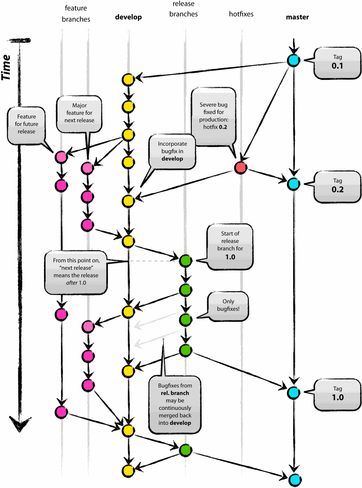
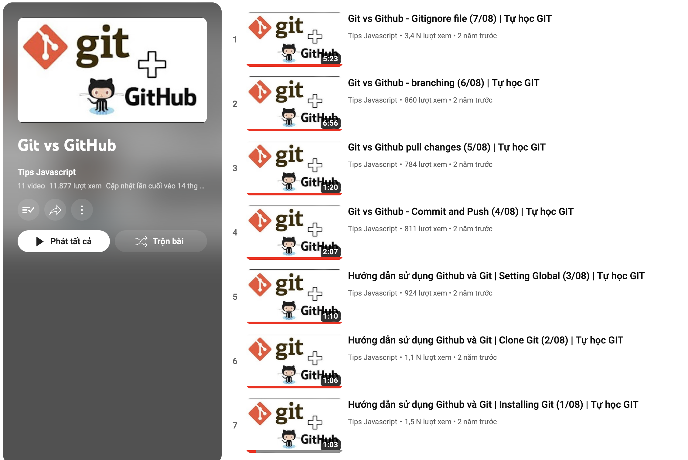

# Task 1 - Learn to use Git

## Contents
- [1. Install Git](#1-install-git)
- [2. Clone Git](#2-clone-git)
- [3. Setting global](#3-setting-global)
- [4. Commit and Push](#4-commit-and-push)
- [5. Pull](#5-pull)
- [6. Branch](#6-branch)
- [7. Gitignore file](#7-gitignore-file)
- [8. Rebase and Merge](#8-rebase-and-merge)
- [9. GitFlow](#9-gitflow)
- [10. More info](#10-more-info)

---
## 1. Install Git
### Installing on Linux
If you’re on Fedora (or any closely-related RPM-based distribution, such as RHEL or CentOS), you can use dnf:

`$ sudo dnf install git-all`

If you’re on a Debian-based distribution, such as Ubuntu, try apt:

`$ sudo apt install git-all`

### Installing on Mac
There are several ways to install Git on macOS. The easiest is probably to install the Xcode Command Line Tools. On Mavericks (10.9) or above you can do this simply by trying to run git from the Terminal the very first time.

`$ git --version`

### Installing in Windows
#### Using **winget** tool: 
Install winget tool if you don't already have it, then type this command in command prompt or Powershell.

`winget install --id Git.Git -e --source winget`

---

## 2. Clone Git

Here we'll examine the git clone command in depth. git clone is a Git command line utility which is used to target an existing repository and create a clone, or copy of the target repository. In this page we'll discuss extended configuration options and common use cases of git clone. 

`git clone ssh://john@example.com/path/to/my-project.git 
cd my-project`
### Cloning to a specific folder
`git clone <repo> <directory>`

### Cloning a specific tag
`git clone --branch <tag> <repo>`

### Shallow clone
`git clone -depth=1 <repo>`

---

## 3. Setting Global

You can specify Git configuration settings with the git config command. One of the first things you did was set up your name and email address:

`git config --global user.name "John Doe"`

`git config --global user.email johndoe@example.com`

---

## 4. Commit and Push

The git commit command captures a snapshot of the project's currently staged changes. 

### Commit

Common options

`git commit`

A shortcut command that immediately creates a commit with a passed commit message. 

`git commit -m "commit message"`

### Push

The git push command is used to upload local repository content to a remote repository. 

`git push <remote> <branch>`

---

## 5. Pull

The git pull command is used to fetch and download content from a remote repository and immediately update the local repository to match that content. 

### Common Options

`git pull <remote>`

---

## 6. Branch

The git branch command lets you create, list, rename, and delete branches. It doesn’t let you switch between branches or put a forked history back together again. 

### Common

List all of the branches in your repository. This is synonymous with `git branch --list`.

`git branch`

Create a new branch called ＜branch＞. This does not check out the new branch.

`git branch <branch>`

---

## 7. Gitignore file

### create file gitignore

`touch .gitignore`

### push file .gitignore

`git add .gitignore`

`git commit -m 'add file gitignore'`

`git push`

---

## 8. Rebase and merge

[Git Rebase vs. Merge: A Complete Guide](https://www.simplilearn.com/git-rebase-vs-merge-article#:~:text=Git%20Merge%20lets%20you%20merge,Git%20Rebase%20logs%20are%20linear.)

[Hiểu Git Rebase và Git Merge](https://www.youtube.com/watch?v=l0VtRcPz1ME&list=PLw0w5s5b9NK7dTWqY1li4u4_dZMNeSjQv&index=9)

>Theo tóm tắt video thì nếu làm project lớn gồm nhiều người tham gia thì nên sử dụng *rebase* để tối ưu cá nhân các *log* của bản thân không bị ảnh hưởng bởi những người khác.

[Merging vs. Rebasing](https://www.atlassian.com/git/tutorials/merging-vs-rebasing)

---

## 9. GitFlow

- Tao nhanh chinh master: khong sua doi code tren nhanh nay
- Tao nhanh developer song song voi nhanh master de hop nhat cac nhanh khac. 
- Phat trien tinh nag
  - Tao cac nhanh tinh nang (future branches).
  - Cac nhanh tinh nang hoan thanh thi merge lai nhanh developer
  - Nhanh developer day len nhanh release
  - Nhanh release se day len master
  - Nhanh master day len production
  - Xoa release version
  - Lap lai de phat trien cac tinh nang khac
- Sua loi
  - Day loi ve nhanh hotfixes
  - Dua ve nhanh developer
  - Sau do se tuong tu nhu phat trien tinh nang
  - Neu loi nho va xu ly nhanh thi tu hotfixes day lai master va day len production luon

- Nhánh chính **master** không được sửa đổi code
- Nhánh **develop** song song với nhánh **master**
- Khi phát triển tính năng:
    - Tạo nhánh feature branch
    - Sau đó merge về nhánh develop
    - Sau đó đẩy về nhánh release
    - Tạo tag version và đẩy về nhánh master
    - Xóa các nhánh feature branch và nhóm release
- Khi sửa đổi tính năng:
    - Sử dụng nhánh hotfixes
    - Đưa về nhánh develop
    -  Sửa xong tạo tag mới ở nhánh release
    - Tiếp tục đẩy về nhánh master 

---

## 10. More info

[Learn Git with Bitbucket Cloud](https://www.atlassian.com/git/tutorials/learn-git-with-bitbucket-cloud)

[Github basic commands](https://www.atlassian.com/git/glossary)

[10 Git Commands Every Developer Should Know](https://www.freecodecamp.org/news/10-important-git-commands-that-every-developer-should-know/)

[Top 20 Git Commands With Examples](https://dzone.com/articles/top-20-git-commands-with-examples)

[35+ Git Commands List Every Programmer Should Know](https://www.loginradius.com/blog/engineering/git-commands/)

## 11. Trust me

