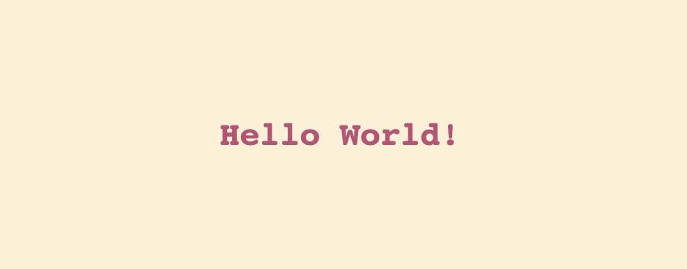
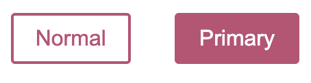
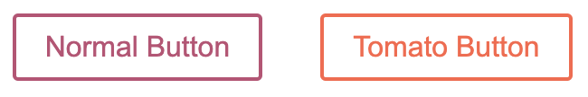

# Task 2 - Learn to use library _styled-components_

## Table of contents

- [1. Introduction](#1-introduction)
- [2. Installing](#2-installing)
- [3. Getting started](#3-getting-started)
- [4. Adapting on props](#4-adapting-on-props)
- [5. Extending styles](#5-extending-styles)
- [6. Coming from CSS](#6-coming-from-css)
- [7. With prop-type library](#7-with-prop-types-library)
- [8. More info](#8-more-info)

---

## 1. Introduction

> Sử dụng _styled-components_ để có thể nâng cao khả năng sử dụng css vào các components React hệ thống. Thiết lập các props Css thuần để tạo nên một hệ thống UI components riêng biệt.

---

## 2. Installing

### With npm

`npm install styled-components`

### With yarn

`yarn add styled-components`

---

## 3. Getting started

_styled-component_ sử dụng tag thuần để tạo ra component cá nhân

```js
// Create a Title component that'll render an <h1> tag with some styles
const Title = styled.h1`
  font-size: 1.5em;
  text-align: center;
  color: #bf4f74;
`;

// Create a Wrapper component that'll render a <section> tag with some styles
const Wrapper = styled.section`
  padding: 4em;
  background: papayawhip;
`;

// Use Title and Wrapper like any other React component – except they're styled!
render(
  <Wrapper>
    <Title>Hello World!</Title>
  </Wrapper>
);
```



---

## 4. Adapting on props

Có thể sử dụng các biến để thay đổi các props bên trong hàm tùy biến component. Nó có thể hiểu đơn giản như là tăng thêm attribute cho các tag mặc định.

```js
const Button = styled.button<{ $primary?: boolean; }>`
  /* Adapt the colors based on primary prop */
  background: ${props => props.$primary ? "#BF4F74" : "white"};
  color: ${props => props.$primary ? "white" : "#BF4F74"};

  font-size: 1em;
  margin: 1em;
  padding: 0.25em 1em;
  border: 2px solid #BF4F74;
  border-radius: 3px;
`;

render(
  <div>
    <Button>Normal</Button>
    <Button $primary>Primary</Button>
  </div>
);
```



---

## 5. Extending styles

Cái này hiểu đơn giản là có thể sử dụng các components đã được tạo từ _styled-components_ để tùy biến thêm trở thành components khác phù hợp với project khác.

```js
// The Button from the last section without the interpolations
const Button = styled.button`
  color: #bf4f74;
  font-size: 1em;
  margin: 1em;
  padding: 0.25em 1em;
  border: 2px solid #bf4f74;
  border-radius: 3px;
`;

// A new component based on Button, but with some override styles
const TomatoButton = styled(Button)`
  color: tomato;
  border-color: tomato;
`;

render(
  <div>
    <Button>Normal Button</Button>
    <TomatoButton>Tomato Button</TomatoButton>
  </div>
);
```



---

## 6. Coming from CSS

Trong components React chúng ta có thể trực tiếp tạo các component theo cách của _styled-component_ library mà không cần tạo file css như bình thường.

```jsx
import React from "react";
import styled from "styled-components";

const StyledCounter = styled.div`
  /* ... */
`;
const Paragraph = styled.p`
  /* ... */
`;
const Button = styled.button`
  /* ... */
`;

export default class Counter extends React.Component {
  state = { count: 0 };

  increment = () => this.setState({ count: this.state.count + 1 });
  decrement = () => this.setState({ count: this.state.count - 1 });

  render() {
    return (
      <StyledCounter>
        <Paragraph>{this.state.count}</Paragraph>
        <Button onClick={this.increment}>+</Button>
        <Button onClick={this.decrement}>-</Button>
      </StyledCounter>
    );
  }
}
```

---

## 7. With _prop-types_ library

Các tham số của hàm tạo component khi sử dụng phải có kí tự _$<var\>_. Vì thế để tối ưu hóa các tên tham số, chúng ta nên kết hợp với _prop-types_ library để tạo các tên attribute không cần dùng _$_.

```js
import theme from "styled-theming";
import styled from "styled-components";
import PropTypes from "prop-types";

const BackgroundColor = theme.variants("mode", "variant", {
  default: { light: "gray", dark: "darkgray" },
  primary: { light: "blue", dark: "darkblue" },
  success: { light: "green", dark: "darkgreen" },
  warning: { light: "orange", dark: "darkorange" },
});

const PhDButton = styled.button`
  background-color: ${BackgroundColor};
`;

PhDButton.propTypes = {
  variant: PropTypes.oneOf(["default", "primary", "success", "warning"]),
};

PhDButton.defaultProps = {
  variant: "default",
};

export default PhDButton;
```

---

## 8. More info


> Ngoài ra có thể tìm hiểu: [sytled-components](https://www.youtube.com/playlist?list=PLmnsJI3O-fYskJJ2nK1kGPXPzCYOTJAOb)


